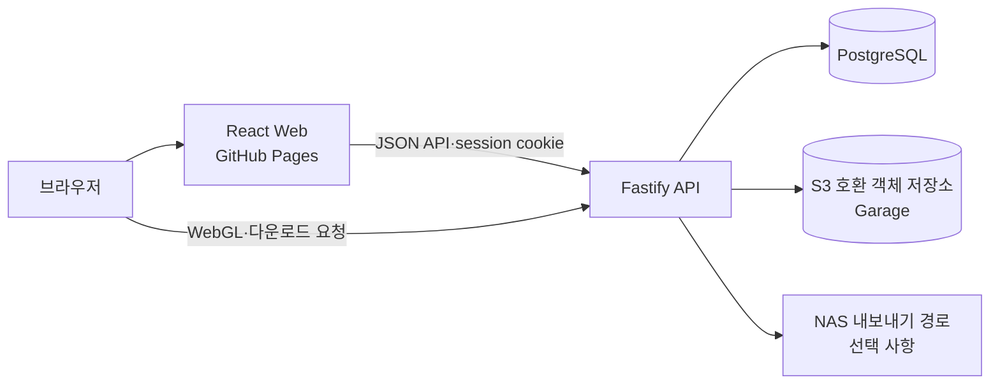

# 배재대학교 게임공학과 졸업작품 전시 시스템

배재대학교 게임공학과의 연도별 졸업작품을 공개하고, 재학생과 운영자가 작품 자료를 등록·관리하는 웹 시스템이다. 공개 전시 화면, 작품 제출 및 운영 화면, API, 관계형 데이터베이스, 객체 저장소와 배포 자동화를 하나의 npm workspace에서 관리한다.

## 주요 기능

### 공개 전시

- 연도와 전시회별 작품 목록 조회
- 작품 설명, 참여 학생, 지원 플랫폼, 이미지·영상 조회
- 게임 배포 파일 다운로드
- 업로드된 Unity WebGL 빌드의 브라우저 실행
- 전시회 포스터와 공개 자산 제공

### 작품 제출 및 운영

- Google 계정 기반 로그인과 `USER`·`OPERATOR`·`ADMIN` 권한 구분
- 재학생의 작품 제출 및 본인 참여 작품 조회
- 작품 기본 정보, 참여 학생, 공개 상태와 정렬 순서 관리
- 이미지·PDF·영상·게임 ZIP·Unity WebGL ZIP 업로드
- 대용량 게임 파일의 S3 multipart 분할 업로드와 재개
- 전시회 개설, 업로드 허용 여부와 포스터 관리
- 작품 일괄 상태 변경·삭제, 차단 IP와 사이트 설정 관리
- 기존 JSON 자료의 검증·가져오기와 NAS 내보내기

## 시스템 구성



| 구성 요소 | 구현 | 역할 |
|---|---|---|
| `apps/web` | React 19, Vite 8, React Router, TanStack Query | 공개 전시, 작품 제출, 운영 화면 |
| `apps/api` | Node.js 22, Fastify 5, Prisma 7 | 인증, 작품·전시 관리, 파일 처리, 공개 자산 제공 |
| `packages/contracts` | TypeScript, Zod | Web과 API가 공유하는 요청·응답 schema와 enum |
| PostgreSQL | PostgreSQL 16 | 사용자, 전시회, 작품, 자산 metadata, session, 업로드 상태 저장 |
| Garage | S3 호환 객체 저장소 | 공개·보호 자산과 multipart 업로드 객체 저장 |

Web은 정적 SPA로 빌드된다. API는 공개·인증·운영 route를 제공하고, PostgreSQL과 객체 저장소 사이의 자산 상태를 관리한다. 게임과 WebGL 대용량 파일은 브라우저에서 S3 multipart 단위로 전송하며, API는 업로드 session, 완료 claim, 정리 작업과 orphan object를 데이터베이스에 기록한다.

## 저장소 구조

```text
.
├── apps/
│   ├── api/                 # Fastify API, Prisma schema·migration, 단위·통합 테스트
│   ├── db/                  # 로컬 PostgreSQL·Garage 구성과 초기화 script
│   └── web/                 # React SPA와 화면 테스트
├── packages/contracts/      # Web/API 공용 Zod 계약
├── prisma/migrations/       # 이전 최상위 migration 기록
├── scripts/                 # 통합 환경 기동과 smoke test
├── server/                  # 운영 API용 Podman 배포 script와 이전 자료 예시
├── docs/                    # 운영 runbook과 backend 검토 기록
└── .github/workflows/       # PR 검증, API 배포, Web 배포
```

현재 Prisma schema와 신규 migration의 기준 위치는 `apps/api/prisma`이다. 최상위 `prisma/migrations`는 이전 migration 기록이며, 개발 명령은 `apps/api` workspace의 Prisma 설정을 사용한다.

## 요구 환경

- Node.js 22
- npm과 저장소의 `package-lock.json`
- Docker Engine 및 Docker Compose v2
- 로컬 개발 포트 `4000`, `5173`, `5432`, `3900`, `3902`

운영 배포에는 별도로 Podman, systemd user service, reverse proxy, PostgreSQL 백업 공간과 S3 호환 저장소 접속 정보가 필요하다.

## 통합 환경 실행

저장소의 전체 경로를 가장 짧게 확인하는 방법이다. PostgreSQL, Garage, API와 Web을 컨테이너로 기동하고 integration seed와 smoke test를 실행한다.

```bash
npm ci
npm run testenv:up
```

기동 이후 접속 위치는 다음과 같다.

| 대상 | 주소 |
|---|---|
| Web | <http://localhost:5173> |
| API | <http://localhost:4000> |
| API 상태 | <http://localhost:4000/api/health> |
| Garage S3 API | <http://localhost:3900> |

통합 환경은 `DEV_AUTH_ENABLED=true`로 실행된다. 로그인 화면의 개발용 인증 기능에서 `USER`, `OPERATOR`, `ADMIN` 동작을 확인할 수 있다. 이 route는 `NODE_ENV=production`에서 등록되지 않는다.

```bash
# 컨테이너 종료 — volume 유지
npm run testenv:down

# 컨테이너와 통합 테스트 volume 제거
npm run testenv:clean

# volume 제거 후 재구성
npm run testenv:reset
```

`testenv:clean`과 `testenv:reset`은 `pcu-integration` Compose project의 PostgreSQL·Garage volume을 제거한다.

## 개발 환경 구성

API와 Web의 hot reload가 필요한 경우 PostgreSQL과 Garage만 Docker로 실행한다.

### 1. 의존성 설치

```bash
npm ci
```

### 2. PostgreSQL·Garage 기동

```bash
docker compose -f apps/db/docker-compose.yml up -d --build
docker compose -f apps/db/docker-compose.yml logs garage-init
```

`garage-init`는 `pcu-public`, `pcu-protected` bucket과 `pcu-dev-key`를 구성한다. 출력된 access key ID와 secret key를 API 환경 변수에 반영한다. 저장소의 기본 PostgreSQL 접속 정보는 개발용이며 운영 환경에 사용하지 않는다.

### 3. 환경 변수 구성

```bash
cp apps/api/.env.example apps/api/.env
cp apps/web/.env.example apps/web/.env.local
```

`apps/api/.env`에서 최소한 다음 항목을 로컬 환경에 정합한다.

- `S3_ACCESS_KEY_ID`, `S3_SECRET_ACCESS_KEY`: `garage-init`에서 생성한 값
- `GOOGLE_CLIENT_IDS`, `VITE_GOOGLE_CLIENT_ID`: 실제 Google OAuth를 확인할 때 사용하는 같은 Web client ID
- `DEV_AUTH_ENABLED=true`, `VITE_DEV_AUTH_ENABLED=true`: 로컬 역할별 동작을 OAuth 없이 확인할 때만 설정

API는 시작 시 환경 변수를 검증한다. `SESSION_SECRET`은 32자 이상이어야 하며, `DATABASE_URL`, `CORS_ALLOWED_ORIGINS`, `API_PUBLIC_URL`, `WEB_PUBLIC_URL`, S3 접속 정보는 필수이다. `.env`와 `.env.local`은 commit하지 않는다.

### 4. database 초기화

```bash
npm run db:generate --workspace=apps/api
npm run db:migrate --workspace=apps/api
npm run db:seed --workspace=apps/api
```

`db:seed`는 개발용 관리자, session, 전시회와 예시 작품을 생성한다. `NODE_ENV=production`에서는 실행을 거부한다. 기존 자료를 가져오려면 `apps/db/legacy-import.json`을 검토한 뒤 다음 명령을 사용한다.

```bash
npm run db:seed:import --workspace=apps/api
```

### 5. 개발 server 실행

두 terminal에서 각각 실행한다.

```bash
npm run dev --workspace=apps/api
```

```bash
npm run dev --workspace=apps/web
```

Web은 <http://localhost:5173>, API는 <http://localhost:4000>에서 실행된다. API의 `/api/health`는 process lifecycle과 database를 확인하고, `/api/health/deep`은 객체 저장소까지 추가로 확인한다.

## 주요 명령

| 명령 | 검증 범위 |
|---|---|
| `npm test` | 모든 workspace의 Vitest test |
| `npm run lint` | API·Web lint와 TypeScript 검사 |
| `npm run architecture` | API 계층 경계, 자체 test, dependency-cruiser 규칙 |
| `npm run build` | 공용 계약, API, Web 순차 build |
| `npm run test:integration` | PostgreSQL·Garage 기반 concurrency·transaction·upload·복구 test와 E2E smoke test |

PR 검증과 동일한 기본 순서는 다음과 같다.

```bash
npm ci --include-workspace-root
npm run db:generate --workspace=apps/api
npm test
npm run lint
npm run architecture
npm audit --audit-level=high
npm run build
```

전체 통합 test는 Docker image build와 서비스 기동을 포함한다. 고정 포트 `15432`, `3900`, `3902`, `3903`, `4000`, `5173`을 사용하므로 기존 process와의 충돌 여부를 먼저 확인한다.

## 데이터와 자산 경계

- PostgreSQL은 자산의 `storageKey`, 공개 여부, 크기, MIME type, 처리 상태를 저장한다.
- Garage의 `pcu-public` bucket은 공개 자산, `pcu-protected` bucket은 보호 자산을 저장한다.
- API는 자산 요청을 검사한 뒤 짧은 유효 기간의 presigned URL로 redirect한다.
- 영상 업로드는 재생용 자산 처리 상태를 별도로 기록한다.
- Unity WebGL ZIP은 archive 경로와 content encoding을 검증한 뒤 공개 실행 경로로 제공한다.
- multipart 업로드의 중단·만료·완료 실패는 background maintenance와 durable task table로 복구한다.

업로드 lifecycle 관련 schema 변경이나 운영 정리 작업 전에는 [업로드 lifecycle 배포 runbook](docs/upload-lifecycle-runbook.md)을 확인한다. `reconcile-orphans.ts --apply`는 신규 API 전환 후 최소 60분을 대기하고 dry run 결과를 검토한 뒤 실행하도록 규정되어 있다.

## 배포 구조

### Web

`master` branch의 `apps/web`, 공용 계약 또는 workspace 설정 변경은 `deploy-web-pages.yml`을 실행한다. test·lint·build를 통과한 `apps/web/dist`를 `pcugame/pcugame.github.io` 저장소의 `master` branch에 게시한다. build 후 생성되는 `404.html`은 GitHub Pages에서 SPA deep link를 처리한다.

Web과 API가 같은 commit에서 변경되면 Web workflow는 같은 SHA의 API 배포 성공을 확인한 뒤 게시한다.

### API

`deploy-api.yml`은 API test와 build를 수행하고 image를 다음 두 tag로 GHCR에 게시한다.

- `latest`
- `sha-<commit SHA>`

배포 단계는 SSH로 `server/deploy.sh`를 전달하고 SHA tag image를 Podman pod에 반영한다. 기존 PostgreSQL container가 있으면 배포 전에 `pg_dump -Fc` backup을 생성한다. 신규 API의 상태 확인이 실패하면 직전 image에 부여한 local rollback tag로 복구하고 workflow를 실패 처리한다.

운영 API port는 기본적으로 `127.0.0.1:4000`에만 bind된다. 외부 요청은 reverse proxy를 통과해야 하며, 운영 `.env`의 origin, cookie, proxy trust, Google hosted domain, S3와 NAS 경로를 실제 환경에 맞게 설정한다.

## 변경 기준

- API 요청·응답을 변경할 때 `packages/contracts`의 schema와 관련 계약 test를 함께 개정한다.
- database 구조를 변경할 때 `apps/api/prisma/schema.prisma`와 migration을 함께 commit하고 [database migration policy](docs/database-migration-policy.md)를 따른다.
- 새 API module은 application·infrastructure 경계를 유지하고 `npm run architecture`를 통과해야 한다.
- 업로드 변경은 파일 signature, 권한, 용량 제한, idempotency, orphan 정리와 동시성 test를 함께 검토한다.
- 배포 관련 변경은 Web과 API의 독립 배포 순서 및 rollback 가능성을 유지한다.

## 관련 문서

- [database migration policy](docs/database-migration-policy.md)
- [업로드 lifecycle 배포 runbook](docs/upload-lifecycle-runbook.md)
- [backend 검토 기록](docs/backend-audit.md)
- [route 계약 소유권 후속 기록](docs/backend-audit-tickets/route-contract-ownership-follow-up.md)
- [추가 test 기록](docs/new_tests/README.md)
